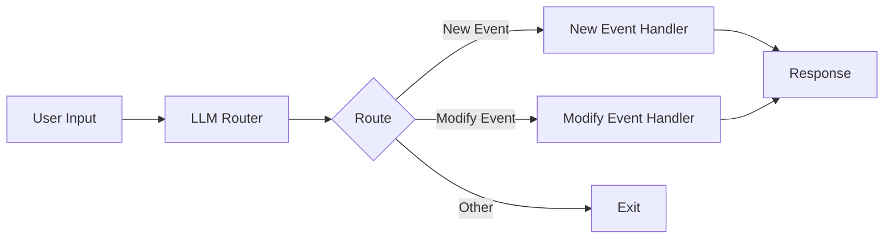

```mermaid
graph LR;
A[User Input] --> B[LLM Router] 
B --> C{Route} 
C -->|New Event| D[New Event Handler] 
C -->|Modify Event| E[Modify Event Handler] 
C -->|Other| F[Exit] 
D --> G[Response] 
E --> G
```

