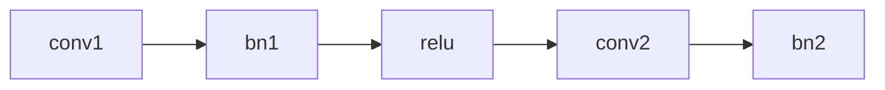

---
## Data

Dataset used for this project is `Div2K`.
The [DIV2K Dataset](https://data.vision.ee.ethz.ch/cvl/DIV2K/) is a large newly collected dataset of RGB images with a large diversity of contents.
Which is further cleaned and preprocessed to get to the below stated state.

Data dir structure that consist of separate train and valid data.
```
data
|-- train
|	|-- train_hr
|	|-- train_x2
|    -- train_x4
|-- valid
|	|-- valid_hr
|	|-- valid_x2
|	 -- valid_x4	
```

- _hr : High resolution
- _x2: High resolution image downgraded by 2x
- _x4: High resolution image downgraded by 4x

| Dir   | Sub-Dir  | Total Images |
| ----- | -------- | ------------ |
| train | train_hr | 800          |
|       | train_x2 | 800          |
|       | train_x4 | 800          |
| valid | valid_hr | 100          |
|       | valid_x2 | 100          |
|       | valid_x4 | 100          |

>**Note**: though from above Total images should be 2700. But the actual data is of total 900 images 800 for train and 100 for valid.
>these 800 for train and 100 for valid is gets downgraded via bicubic interpolation method. resulted total image of 2700.

### Data Inspection
In `.ipynb` notebook of SRGAN a `view_random_image(target_dir)` function is written that randomly choses a sample image from the selected target_dir also providing shape of the resulted image.

```python
# View an image
import matplotlib.pyplot as plt
import matplotlib.image as mpimg
import random

def view_random_image(target_dir):
  random_image = random.sample(os.listdir(target_dir), 1)   # train or valid

  # Read image and display via matplotlib
  img = mpimg.imread(target_dir + random_image[0])
  plt.imshow(img)
  plt.axis("off");

  print(f"Image shape: {img.shape}")  # show the shape of the image
  return img
```

>**Note:** Image shapes are different for all, resizing is done making all the images whether `train/*` or `valid/*` of shape 510x510x3 with 3 colour channel as constant.

---
## Resizing Images
Resizing images to a consistent shape of 510x510x3 throughout model train and project.
function `resize_images_in_folder(folder_path, output_size)` takes the folder-path and output-size as an argument and resize the images by parsing throughout the given directory.

```python
import numpy as np
import torch.nn.functional as F

def resize_images_in_folder(folder_path, output_size):
  for filename in os.listdir(folder_path):
    if filename.lower().endswith(('.png', '.jpg', '.jpeg', '.bmp', '.tiff')):
      image_path = os.path.join(folder_path, filename)
      try:
        # with Image.open(image_path) as img:
        #   resized_img = img.resize(output_size, Image.Resampling.LANCZOS)
        #   resized_img.save(image_path)  # Overwrite the original image
        #   print(f'Resized: {image_path}')

        with Image.open(image_path) as img:
          img_tensor = torch.tensor(np.array(img)).permute(2, 0, 1).float().unsqueeze(0).to(device)
          resized_tensor = F.interpolate(img_tensor, size=output_size, mode='bilinear', align_corners=False)
          resized_img = Image.fromarray(resized_tensor.squeeze(0).permute(1, 2, 0).byte().cpu().numpy())
          resized_img.save(image_path)
      except Exception as e:
          print(f'Error resizing {image_path}: {e}')
```

```python

# resizing all images into fixed size of (360, 510)
base_dir_train = "/content/drive/MyDrive/Data/div2k/div2k/train"
folders = ['train_hr', 'train_x2', 'train_x4']
output_size = (510, 510)

for folder in folders:
    folder_path = os.path.join(base_dir_train, folder)
    if os.path.exists(folder_path):
        print(f'Processing folder: {folder_path}')
        resize_images_in_folder(folder_path, output_size)
    else:
        print(f'Folder not found: {folder_path}')

print('All images have been resized successfully!')
```

---
## Necessary Imports 

```python
import torch
import torch.nn as nn
import torch.optim as optim
import torchvision
from torchvision import transforms, models
from torch.utils.data import DataLoader
import os
from PIL import Image
```

- **`torch`**: Using PyTorch as an Framework for training model 
- **`torch.nn`**: Is a core module that provides classes and functions to create and train neural networks.
- **`torch.optim`**: PyTorch module that provides optimization algorithms to train neural networks by updating their parameters based on gradients. These optimizers help minimize (or maximize) a loss function during training.
- **`torchvision`**: Library Specifically designed for computer vision task. It simplifies the implementation of deep learning projects in vision by offering pre-built components.
	- **`transforms`**: A method in `torchvision.transforms` that provides a set of utilities for preprocessing and augmenting image data.
	- **`models`**: provides pre-defined and pre-trained models for common deep learning tasks, especially in computer vision. here (VGG16)
- **`torch.utils.data`**: PyTorch module designed to handle data loading, processing, and batching efficiently.
	- **`DataLoader`**: responsible for efficiently loading and batching data from a dataset. They handle shuffling, batching, and parallel data loading, making them essential for training models.
- **`os`**: Python core module that provide a way to interact with operating system. Here used for parsing and performing action over directories.
- **`PIL`**: Python Image Library or processing images in Python. Now part of Pillow (library)
	- **`Image`**: is a class that represents an image object, which can be manipulated in many ways. It provides functionality for opening, manipulating, and saving images in various formats.

---
## Helper Functions
Single `helperfunction.py` file that contains all the necessary helper function that is required in this project.

Contains:
- `view_random_image()`
- `resize_images_in_folder()`
- `save_checkpoints()`
- `save_model()`  // TODO creating function that saves model
- `calculate_psnr()` //TODO calculate peak signal to noise ratio
- `load_generator()` //TODO loads saved generator 
- `save_workspace()` //TODO saves workspace/session on colab

---
## BaseModel
- ResidualBlock
- Generator
- Discriminator
- VGGContentLoss
- train_srgan
- SRDataset
- Main Execution

---
### Residual Block 
- The Residual Block is designed to learn residuals, meaning it tries to learn the difference between the original input and the desired output. 
- This makes the training more effective and helps in training deeper networks.



```python
class ResidualBlock(nn.Module):
  def __init__(self, num_features=64):
    super(ResidualBlock, self).__init__()
    self.conv1 = nn.Conv2d(num_features, num_features,
                           kernel_size=3, stride=1, padding=1)
    self.bn1 = nn.BatchNorm2d(num_features)
    self.prelu = nn.PReLU(inplace=True)
    
    self.conv2 = nn.Conv2d(num_features, num_features,
                           kernel_size=3, stride=1, padding=1)
    self.bn2 = nn.BatchNorm2d(num_features)

  def forward(self, x):
    residual = x
    out = self.conv1(x)
    out = self.bn1(out)
    out = self.prelu(out)
    out = self.conv2(out)
    out = self.bn2(out)
    out += residual # element wise sum 
    return out
```
	
- `class ResidualBlock(nn.Module)`: Residual Block class that used to learn residuals which makes training more effective.
	- `nn.Module`: Base class for all neural network modules. models should also subclass this class. Modules can also contain other Modules, allowing to nest them in a tree structure.
- `def __init__(self, num_features)`: This is the constructor of ResidualBlock. It initialises the block with specified number of features (channels). The constructor calls `super(ResidualBlock, self).__init__()`, which ensures that the parent class's (`nn.Module`) constructor is also called. This is important for setting up the PyTorch `Module` correctly.
	- `super(ResidualBlock, self).__init__()`: ensures parents class constructor is also called. or `super().__init__()`.
	- `conv`: Convolutional Layer takes `num_features` as input channel and `num_features` as output channel.
	- `bn`: Batch Normalization layer It normalizes each feature map in the batch independently. Commonly used in CNNs to stabilize the training process and speed it up. It adjusts the inputs by removing the mean and scaling them by the standard deviation. The `num_features` parameter indicates the number of channels (or features) in the input tensor.
	- `relu`: This is the ReLU activation function, which introduces non-linearity into the network. The `inplace=True` parameter ensures that the ReLU operation modifies the input tensor directly without allocating extra memory.
- `def forward(self, x)`: The forward method describes how data flows through the block during the forward pass in a neural network. When you pass input data to the block, it processes the data through its defined layers.
	- 

The residual block effectively learns the residual (or difference) between the original input and the output after applying convolutional layers. This allows the block to pass gradients efficiently during backpropagation and helps in training deeper networks.
The final output of the block is the sum of the original input and the transformed input through the two convolutional layers and batch normalizations.
This design allows the network to be more stable and enables the learning of complex features effectively.

---

### Generator


```python
class Generator(nn.Module):
	def __init__(self, num_residual_blocks=5, num_features=64):
		super(Generator, self).__init__()
		
		# Initial Conv + PReLU
		self.initial = nn.Sequential(
			nn.Conv2d(in_channel=3, out_channel=num_features, kernel_size=9, stride=1, padding=1),
			nn.PReLU()
		)
		
		# Residual Blocks
		self.res_blocks = nn.Sequential(
			*[ResidualBlock(num_features) for _ in range(num_residual_blocks)]
		)
		
		# Conv + BN
		self.conv_after_res = nn.Sequential(
			nn.Conv2d(num_features, num_features, kernel_size=3, stride=1, padding=1),
			nn.BatchNorm2d(num_features)
		)
		
		# Upsampling layer (PixelShuffle)
		self.upsample = nn.Sequential(
			nn.Conv2d(num_features, num_features * 4, kernel_size=3, stride=1, padding=1),
			nn.PixelShuffle(upscale_factor=2),
			nn.PReLU(),
			
			nn.Conv2d(num_features, num_features * 4, kernel_size=3, stride=1, padding=1),
			nn.PixelShuffle(upscale_factor=2),
			nn.PReLU(),
		)
		
		# Final Conv Layer
		self.final = nn.Conv2d(num_features, 3, kernel_size=9, stride=1, padding=1)

	def forward(self, x):
		
		# Save the initial input for the skip connection 
		initial_out = self.initial(x)
		
		# Pass through Residual Blocks
		res_out = self.res_blocks(initial_out)
		 
		# Adding skip connection after the residual blocks
		res_out = self.conv_after_res(res_out)
		res_out += initial_out  # Element-wise sum
		
		# Upsample the output
		upsample_out = self.upsample(res_out)
		
		# Final output
		return self.final(upsampled_out)
```

- **Initial Layers:** A convolutional layer with a kernel size of 9 and PReLU activation.
- **Residual Blocks:** Five residual blocks are stacked, each performing two convolutions and batch normalization with an element-wise sum.
- **Skip Connection:** After the residual blocks, the output is added back to the initial feature map via an element-wise sum.
- **Upsampling:** Two `PixelShuffle` layers upscale the feature map by a factor of 4.
- **Final Layer:** A convolutional layer maps the output to the desired three RGB channels.

---
### Discriminator

```python
class Discriminator(nn.Module):
	def __init__(self):
		super(Discriminator, self).__init__()
		
		# Define a function for a Conv -> BN -> LeakyReLU
		def conv_block(in_channel, out_channel, kernel_size=3, stride=1, padding=1, use_bn=True):
			layers = [nn.Conv2d(in_channel, out_channel, kernel_size, stride, padding)]
			
			if use_bin:
				layers.append(nn.BatchNorm2d(out_channels))
			layers.append(nn.LeakyReLU(0.2, inplace=True))
			
			return nn.Sequential(*layers)
		
		# Convolutional Layers	
		self.conv_layers = nn.Sequential(
			conv_block(3, 64, stride=1, use_bn=False),   # No BN for first layer
			conv_block(3, 64, stride=2)  # Conv2
			conv_block(64, 128, stride=1) # Conv3
			conv_block(128, 128, stride=2) # Conv4
			conv_block(128, 256, stride=1) # Conv5
			conv_block(256, 256, stride=2) # Conv6
			conv_block(256, 512, stride=1) # Conv7			
			conv_block(512, 512, stride=2) # Conv8				
		)
		
		# Fully Connected Layers
		self.fc = nn.Sequential(
			nn.Flatten(),    # Flatten for linear layers
			nn.Linear(512 * 6 * 6, 1024),   # First FC layer
			nn.LeakyReLU(0.2, inplace=True) # LeakyReLU Activation
			nn.Linear(1024, 1)  # Second FC layer (output 1 value)
			nn.Sigmoid()    # Sigmoid for bianry classification
		)
	
	def forward(self, x):
		out = self.conv_layers(x) # pass through convolutional layers
		out = self.fc(out)        # pass through fully connected layers
		return out
```

---
### VGG Content Loss

```python
# Define the VGG-based Content Loss 
class VGGContentLoss(nn.Module): 
	def __init__(self): 
		super(VGGContentLoss, self).__init__() 
		vgg = models.vgg19(pretrained=True).features 
		self.vgg = nn.Sequential(*list(vgg[:36])).eval() 
		for param in self.vgg.parameters(): 
			param.requires_grad = False 
		self.vgg = self.vgg.cuda() 
	
	def forward(self, sr, hr): 
		sr_features = self.vgg(sr) 
		hr_features = self.vgg(hr) 
		return nn.functional.mse_loss(sr_features, hr_features)
```

---
### Train SRGAN model

```python
# Training setup
def train_srgan(generator, discriminator, dataloader, num_epochs=100):
    # Optimizers
    g_optimizer = optim.Adam(generator.parameters(), lr=1e-4)
    d_optimizer = optim.Adam(discriminator.parameters(), lr=1e-4)

    # Losses
    adversarial_loss = nn.BCELoss()
    content_loss = VGGContentLoss()

    for epoch in range(num_epochs):
        for i, (lr_imgs, hr_imgs) in enumerate(dataloader):
            lr_imgs, hr_imgs = lr_imgs.cuda(), hr_imgs.cuda()

            # Train Discriminator
            d_optimizer.zero_grad()

            real_labels = torch.ones(hr_imgs.size(0), 1).cuda()
            fake_labels = torch.zeros(hr_imgs.size(0), 1).cuda()

            real_outputs = discriminator(hr_imgs)
            fake_outputs = discriminator(generator(lr_imgs).detach())

            d_loss_real = adversarial_loss(real_outputs, real_labels)
            d_loss_fake = adversarial_loss(fake_outputs, fake_labels)
            d_loss = d_loss_real + d_loss_fake

            d_loss.backward()
            d_optimizer.step()

            # Train Generator
            g_optimizer.zero_grad()

            fake_outputs = discriminator(generator(lr_imgs))
            adv_loss = adversarial_loss(fake_outputs, real_labels)
            cont_loss = content_loss(generator(lr_imgs), hr_imgs)

            g_loss = cont_loss + 1e-3 * adv_loss

            g_loss.backward()
            g_optimizer.step()

            if i % 10 == 0:
                print(f"Epoch [{epoch}/{num_epochs}], Step [{i}/{len(dataloader)}], D Loss: {d_loss.item():.4f}, G Loss: {g_loss.item():.4f}")

        # Save checkpoint every 1/5th of epochs
        if epoch % 20 == 0:
          checkpoint_filename = os.path.join(checkpoint_dir, f'checkpoint_epoch_{epoch}.pkl')
          save_checkpoints(epoch, generator, discriminator, g_optimizer, d_optimizer, checkpoint_filename)
          print(f'Checkpoint saved for epoch {epoch} at {checkpoint_filename}')
```

### SRDataset 

```python
# Dataset class for loading LR and HR images
class SRDataset(Dataset):
    def __init__(self, root_dir, transform_lr, transform_hr):
        self.image_paths = [os.path.join(root_dir, img) for img in os.listdir(root_dir)]
        self.transform_lr = transform_lr
        self.transform_hr = transform_hr

    def __len__(self):
        return len(self.image_paths)

    def __getitem__(self, idx):
        img = Image.open(self.image_paths[idx]).convert('RGB')
        hr_img = self.transform_hr(img)
        lr_img = self.transform_lr(img)
        return lr_img, hr_img
```

### Main Execution

```python
# Main execution
if __name__ == "__main__":
    # Data loading
    transform_hr = transforms.Compose([
        transforms.Resize((96, 96)),
        transforms.ToTensor()
    ])
    transform_lr = transforms.Compose([
        transforms.Resize((24, 24)),
        transforms.ToTensor()
    ])

    dataset = SRDataset("/content/drive/MyDrive/Data/div2k/div2k/train/train_hr", transform_lr, transform_hr)
    dataloader = DataLoader(dataset, batch_size=16, shuffle=True)

    # Model initialization
    generator = Generator().to(device)
    discriminator = Discriminator().to(device)

    # Train SRGAN
    train_srgan(generator, discriminator, dataloader)
```


