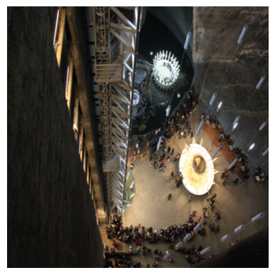

## Drive Mount


```python
from google.colab import drive
drive.mount('/content/drive')
```

    Mounted at /content/drive


## The Data


```python
# train data -> train_hr train_x2 train_x4 resolution
# valid data -> valid_hr valid_x2 valid_x4 resolution

import os


# Walk through data directory and list number of files
for dirpath, dirnames, filenames in os.walk("/content/drive/MyDrive/Data/div2k/div2k"):
  print(f"There are {len(dirnames)} directories and {len(filenames)} images in '{dirpath}'.")
```

    There are 2 directories and 1 images in '/content/drive/MyDrive/Data/div2k/div2k'.
    There are 3 directories and 1 images in '/content/drive/MyDrive/Data/div2k/div2k/valid'.
    There are 0 directories and 100 images in '/content/drive/MyDrive/Data/div2k/div2k/valid/valid_hr'.
    There are 0 directories and 100 images in '/content/drive/MyDrive/Data/div2k/div2k/valid/valid_x4'.
    There are 0 directories and 100 images in '/content/drive/MyDrive/Data/div2k/div2k/valid/valid_x2'.
    There are 3 directories and 1 images in '/content/drive/MyDrive/Data/div2k/div2k/train'.
    There are 0 directories and 800 images in '/content/drive/MyDrive/Data/div2k/div2k/train/train_hr'.
    There are 0 directories and 800 images in '/content/drive/MyDrive/Data/div2k/div2k/train/train_x2'.
    There are 0 directories and 800 images in '/content/drive/MyDrive/Data/div2k/div2k/train/train_x4'.


### Data Inspection


```python
# View an image
import matplotlib.pyplot as plt
import matplotlib.image as mpimg
import random

def view_random_image(target_dir):
  random_image = random.sample(os.listdir(target_dir), 1)   # train or valid

  # Read image and display via matplotlib
  img = mpimg.imread(target_dir + random_image[0])
  plt.imshow(img)
  plt.axis("off");

  print(f"Image shape: {img.shape}")  # show the shape of the image
  return img
```


```python
# View a random image high resolution from train dataset
img_hr_train = view_random_image(target_dir = "/content/drive/MyDrive/Data/div2k/div2k/train/train_hr/")
```

    Image shape: (1356, 2040, 3)


    

    


```python
# View a random 2x downscale image form train_x2
img_x2_train = view_random_image(target_dir = "/content/drive/MyDrive/Data/div2k/div2k/train/train_x2/")
```

    Image shape: (678, 1020, 3)


    

    


```python
# View a random 4x downscale image form train_x4
img_x4_train = view_random_image(target_dir = "/content/drive/MyDrive/Data/div2k/div2k/train/train_x4/")
```

    Image shape: (339, 510, 3)


    

    


## Imports


```python
import torch
import torch.nn as nn
import torch.optim as optim
import torchvision
from torchvision import transforms, models
from torch.utils.data import DataLoader
import os
from PIL import Image
```


```python
device = "cuda" if torch.cuda.is_available() else "cpu"
device
```


    'cuda'


## Resizing Images


```python
import numpy as np
import torch.nn.functional as F

# resizing all images into fixed size of (360, 510)
base_dir_train = "/content/drive/MyDrive/Data/div2k/div2k/train"
folders = ['train_hr', 'train_x2', 'train_x4']
output_size = (510, 510)

def resize_images_in_folder(folder_path, output_size):
  for filename in os.listdir(folder_path):
    if filename.lower().endswith(('.png', '.jpg', '.jpeg', '.bmp', '.tiff')):
      image_path = os.path.join(folder_path, filename)
      try:
        # with Image.open(image_path) as img:
        #   resized_img = img.resize(output_size, Image.Resampling.LANCZOS)
        #   resized_img.save(image_path)  # Overwrite the original image
        #   print(f'Resized: {image_path}')

        with Image.open(image_path) as img:
          img_tensor = torch.tensor(np.array(img)).permute(2, 0, 1).float().unsqueeze(0).to(device)
          resized_tensor = F.interpolate(img_tensor, size=output_size, mode='bilinear', align_corners=False)
          resized_img = Image.fromarray(resized_tensor.squeeze(0).permute(1, 2, 0).byte().cpu().numpy())
          resized_img.save(image_path)
      except Exception as e:
          print(f'Error resizing {image_path}: {e}')
```


```python
for folder in folders:
    folder_path = os.path.join(base_dir_train, folder)
    if os.path.exists(folder_path):
        print(f'Processing folder: {folder_path}')
        resize_images_in_folder(folder_path, output_size)
    else:
        print(f'Folder not found: {folder_path}')

print('All images have been resized successfully!')
```

    Processing folder: /content/drive/MyDrive/Data/div2k/div2k/train/train_hr
    Processing folder: /content/drive/MyDrive/Data/div2k/div2k/train/train_x2
    Processing folder: /content/drive/MyDrive/Data/div2k/div2k/train/train_x4
    All images have been resized successfully!


### Verify the result


```python
# train_hr
img_hr_train = view_random_image(target_dir = "/content/drive/MyDrive/Data/div2k/div2k/train/train_hr/")
```

    Image shape: (510, 510, 3)


    

    


```python
# train_x2
img_x2_train = view_random_image(target_dir = "/content/drive/MyDrive/Data/div2k/div2k/train/train_x2/")
```

    Image shape: (510, 510, 3)


    

    


```python
# train_x4
img_x2_train = view_random_image(target_dir = "/content/drive/MyDrive/Data/div2k/div2k/train/train_x4/")
```

    Image shape: (510, 510, 3)


    

    


## Generator model


```python
class ResidualBlock(nn.Module):
  def __init__(self, num_features):
    super(ResidualBlock, self).__init__()
    self.conv1 = nn.Conv2d(num_features, num_features,
                           kernel_size=3, stride=1, padding=1)
    self.bn1 = nn.BatchNorm2d(num_features)
    self.relu = nn.ReLU(inplace=True)
    self.conv2 = nn.Conv2d(num_features, num_features,
                           kernel_size=3, stride=1, padding=1)
    self.bn2 = nn.BatchNorm2d(num_features)

  def forward(self, x):
    residual = x
    out = self.conv1(x)
    out = self.bn1(out)
    out = self.relu(out)
    out = self.conv2(out)
    out = self.bn2(out)
    return out + residual
```


```python
class Generator(nn.Module):
  def __init__(self, num_residual_blocks=16, num_features=64):
    super(Generator, self).__init__()
    self.conv1 = nn.Conv2d(3, num_features, kernel_size=9,
                           stride=1, padding=4)
    self.relu = nn.ReLU(inplace=True)

    self.res_blocks = nn.Sequential(*[ResidualBlock(num_features) for _ in range(num_residual_blocks)])

    self.upsample1 = nn.Conv2d(num_features, num_features * 4, kernel_size=3,
                               stride=1, padding=1)
    self.pixel_shuffle1 = nn.PixelShuffle(2)

    self.upsample2 = nn.Conv2d(num_features, num_features * 4, kernel_size=3,
                               stride=1, padding=1)
    self.pixel_shuffle2 = nn.PixelShuffle(2)

    self.conv2 = nn.Conv2d(num_features, 3, kernel_size=9,
                           stride=1, padding=4)
    self.tanh = nn.Tanh()

    # Upsampling layer for the residual connection
    self.residual_upsample = nn.Sequential(
    nn.Upsample(scale_factor=4, mode='bilinear', align_corners=False),  # Upsample the residual tensor
    nn.Conv2d(num_features, 3, kernel_size=3, stride=1, padding=1)  # Match the output channels
)

  def forward(self, x):
    out = self.relu(self.conv1(x))
    residual = out  # save the low-resolution residual

    out = self.res_blocks(out)
    out = self.upsample1(out)
    out = self.pixel_shuffle1(out)
    out = self.upsample2(out)
    out = self.pixel_shuffle2(out)

    # Upsample the residual to match the high-resolution output
    residual = self.residual_upsample(residual)
    out = self.conv2(out)
    added = out + residual
    return self.tanh(added)
```


```python
class Discriminator(nn.Module):
    def __init__(self):
        super(Discriminator, self).__init__()
        def conv_block(in_channels, out_channels, stride=1):
            return nn.Sequential(
                nn.Conv2d(in_channels, out_channels, kernel_size=3, stride=stride, padding=1),
                nn.BatchNorm2d(out_channels),
                nn.LeakyReLU(0.2, inplace=True)
            )

        self.model = nn.Sequential(
            conv_block(in_channels=3, out_channels=64, stride=1),
            conv_block(64, 64, stride=2),
            conv_block(64, 128, stride=1),
            conv_block(128, 128, stride=2),
            conv_block(128, 256, stride=1),
            conv_block(256, 256, stride=2),
            conv_block(256, 512, stride=1),
            conv_block(512, 512, stride=2),
            nn.Flatten(),
            nn.Linear(512 * 6 * 6, 1024),
            nn.LeakyReLU(0.2, inplace=True),
            nn.Linear(1024, 1),
            nn.Sigmoid()
        )

    def forward(self, x):
        return self.model(x)

# Define the VGG-based Content Loss
class VGGContentLoss(nn.Module):
    def __init__(self):
        super(VGGContentLoss, self).__init__()
        vgg = models.vgg19(pretrained=True).features
        self.vgg = nn.Sequential(*list(vgg[:36])).eval()
        for param in self.vgg.parameters():
            param.requires_grad = False
        self.vgg = self.vgg.cuda()

    def forward(self, sr, hr):
        sr_features = self.vgg(sr)
        hr_features = self.vgg(hr)
        return nn.functional.mse_loss(sr_features, hr_features)
```


```python
# Checkpoints
import pickle

# Directory to save checkpoints
checkpoint_dir = '/content/drive/MyDrive/Data/div2k/div2k/checkpoints'
os.makedirs(checkpoint_dir, exist_ok=True)

def save_checkpoints(epoch, generator, discriminator, g_optimizer, d_optimizer, filename):
    checkpoint = {
      'epoch': epoch,
      'generator_state_dict': generator.state_dict(),
      'discriminator_state_dict': discriminator.state_dict(),
      'G_optimizer_state_dict': g_optimizer.state_dict(),
      'D_optimizer_state_dict': d_optimizer.state_dict(),
    }
    with open(filename, 'wb') as f:
        pickle.dump(checkpoint, f)
```


```python
# Training setup
def train_srgan(generator, discriminator, dataloader, num_epochs=100):
    # Optimizers
    g_optimizer = optim.Adam(generator.parameters(), lr=1e-4)
    d_optimizer = optim.Adam(discriminator.parameters(), lr=1e-4)

    # Losses
    adversarial_loss = nn.BCELoss()
    content_loss = VGGContentLoss()

    # checkpoint freq
    save_frequency = num_epochs // 20

    for epoch in range(num_epochs):
        for i, (lr_imgs, hr_imgs) in enumerate(dataloader):
            lr_imgs, hr_imgs = lr_imgs.cuda(), hr_imgs.cuda()

            # Train Discriminator
            d_optimizer.zero_grad()

            real_labels = torch.ones(hr_imgs.size(0), 1).cuda()
            fake_labels = torch.zeros(hr_imgs.size(0), 1).cuda()

            real_outputs = discriminator(hr_imgs)
            fake_outputs = discriminator(generator(lr_imgs).detach())

            d_loss_real = adversarial_loss(real_outputs, real_labels)
            d_loss_fake = adversarial_loss(fake_outputs, fake_labels)
            d_loss = d_loss_real + d_loss_fake

            d_loss.backward()
            d_optimizer.step()

            # Train Generator
            g_optimizer.zero_grad()

            fake_outputs = discriminator(generator(lr_imgs))
            adv_loss = adversarial_loss(fake_outputs, real_labels)
            cont_loss = content_loss(generator(lr_imgs), hr_imgs)

            g_loss = cont_loss + 1e-3 * adv_loss

            g_loss.backward()
            g_optimizer.step()

            if i % 10 == 0:
                print(f"Epoch [{epoch}/{num_epochs}], Step [{i}/{len(dataloader)}], D Loss: {d_loss.item():.4f}, G Loss: {g_loss.item():.4f}")

        # Save checkpoint every 1/5th of epochs
        if epoch % save_frequency == 0:
          checkpoint_filename = os.path.join(checkpoint_dir, f'checkpoint_epoch_{epoch}.pkl')
          save_checkpoints(epoch, generator, discriminator, g_optimizer, d_optimizer, checkpoint_filename)
          print(f'Checkpoint saved for epoch {epoch} at {checkpoint_filename}')

```


```python
# Dataset class for loading LR and HR images
class SRDataset(Dataset):
    def __init__(self, root_dir, transform_lr, transform_hr):
        self.image_paths = [os.path.join(root_dir, img) for img in os.listdir(root_dir)]
        self.transform_lr = transform_lr
        self.transform_hr = transform_hr

    def __len__(self):
        return len(self.image_paths)

    def __getitem__(self, idx):
        img = Image.open(self.image_paths[idx]).convert('RGB')
        hr_img = self.transform_hr(img)
        lr_img = self.transform_lr(img)
        return lr_img, hr_img

```


```python
# Main execution
if __name__ == "__main__":
    # Data loading
    transform_hr = transforms.Compose([
        transforms.Resize((96, 96)),
        transforms.ToTensor()
    ])
    transform_lr = transforms.Compose([
        transforms.Resize((24, 24)),
        transforms.ToTensor()
    ])

    dataset = SRDataset("/content/drive/MyDrive/Data/div2k/div2k/train/train_hr", transform_lr, transform_hr)
    dataloader = DataLoader(dataset, batch_size=16, shuffle=True)

    # Model initialization
    generator = Generator().to(device)
    discriminator = Discriminator().to(device)

    # Train SRGAN
    train_srgan(generator, discriminator, dataloader)
```

    Epoch [0/100], Step [0/50], D Loss: 1.3527, G Loss: 0.5407
    Epoch [0/100], Step [10/50], D Loss: 0.0000, G Loss: 0.4123
    Epoch [0/100], Step [20/50], D Loss: 0.0000, G Loss: 0.4342
    Epoch [0/100], Step [30/50], D Loss: 0.0015, G Loss: 0.4753
    Epoch [0/100], Step [40/50], D Loss: 0.0000, G Loss: 0.2824
    Checkpoint saved for epoch 0 at /content/drive/MyDrive/Data/div2k/div2k/checkpoints/checkpoint_epoch_0.pkl
    Epoch [1/100], Step [0/50], D Loss: 0.1043, G Loss: 0.3396
    Epoch [1/100], Step [10/50], D Loss: 0.0018, G Loss: 0.4429
    Epoch [1/100], Step [20/50], D Loss: 0.0000, G Loss: 0.3710
    Epoch [1/100], Step [30/50], D Loss: 0.0000, G Loss: 0.4035
    Epoch [1/100], Step [40/50], D Loss: 0.0000, G Loss: 0.4176
    Epoch [2/100], Step [0/50], D Loss: 0.0000, G Loss: 0.3926
    Epoch [2/100], Step [10/50], D Loss: 0.0000, G Loss: 0.2876
    Epoch [2/100], Step [20/50], D Loss: 0.0000, G Loss: 0.3797
    Epoch [2/100], Step [30/50], D Loss: 0.0001, G Loss: 0.3895
    Epoch [2/100], Step [40/50], D Loss: 0.0000, G Loss: 0.3654
    Epoch [3/100], Step [0/50], D Loss: 0.0000, G Loss: 0.3827
    Epoch [3/100], Step [10/50], D Loss: 0.0000, G Loss: 0.3625
    Epoch [3/100], Step [20/50], D Loss: 0.0000, G Loss: 0.3212
    Epoch [3/100], Step [30/50], D Loss: 0.0000, G Loss: 0.3932
    Epoch [3/100], Step [40/50], D Loss: 0.0001, G Loss: 0.3235
    Epoch [4/100], Step [0/50], D Loss: 0.0000, G Loss: 0.3185
    Epoch [4/100], Step [10/50], D Loss: 0.0000, G Loss: 0.2724
    Epoch [4/100], Step [20/50], D Loss: 0.0129, G Loss: 0.3644
    Epoch [4/100], Step [30/50], D Loss: 0.0255, G Loss: 0.3008
    Epoch [4/100], Step [40/50], D Loss: 0.0000, G Loss: 0.4228
    Epoch [5/100], Step [0/50], D Loss: 0.0000, G Loss: 0.3453
    Epoch [5/100], Step [10/50], D Loss: 0.0000, G Loss: 0.3416
    Epoch [5/100], Step [20/50], D Loss: 0.0000, G Loss: 0.3598
    Epoch [5/100], Step [30/50], D Loss: 0.0000, G Loss: 0.4105
    Epoch [5/100], Step [40/50], D Loss: 0.0000, G Loss: 0.3965
    Checkpoint saved for epoch 5 at /content/drive/MyDrive/Data/div2k/div2k/checkpoints/checkpoint_epoch_5.pkl
    Epoch [6/100], Step [0/50], D Loss: 0.0000, G Loss: 0.3662
    Epoch [6/100], Step [10/50], D Loss: 0.0000, G Loss: 0.2997
    Epoch [6/100], Step [20/50], D Loss: 0.0000, G Loss: 0.3429
    Epoch [6/100], Step [30/50], D Loss: 0.0000, G Loss: 0.3990
    Epoch [6/100], Step [40/50], D Loss: 0.0000, G Loss: 0.3617
    Epoch [7/100], Step [0/50], D Loss: 0.0000, G Loss: 0.3111
    Epoch [7/100], Step [10/50], D Loss: 0.0000, G Loss: 0.4170
    Epoch [7/100], Step [20/50], D Loss: 0.0000, G Loss: 0.3952
    Epoch [7/100], Step [30/50], D Loss: 0.0000, G Loss: 0.5072
    Epoch [7/100], Step [40/50], D Loss: 0.0000, G Loss: 0.3593
    Epoch [8/100], Step [0/50], D Loss: 0.0000, G Loss: 0.3548
    Epoch [8/100], Step [10/50], D Loss: 0.0000, G Loss: 0.3997
    Epoch [8/100], Step [20/50], D Loss: 0.0000, G Loss: 0.3336
    Epoch [8/100], Step [30/50], D Loss: 0.0000, G Loss: 0.3345
    Epoch [8/100], Step [40/50], D Loss: 0.0000, G Loss: 0.3621
    Epoch [9/100], Step [0/50], D Loss: 0.0000, G Loss: 0.4342
    Epoch [9/100], Step [10/50], D Loss: 0.0000, G Loss: 0.4564
    Epoch [9/100], Step [20/50], D Loss: 0.0000, G Loss: 0.3075
    Epoch [9/100], Step [30/50], D Loss: 0.0000, G Loss: 0.4465
    Epoch [9/100], Step [40/50], D Loss: 0.0000, G Loss: 0.3836
    Epoch [10/100], Step [0/50], D Loss: 0.0000, G Loss: 0.3721
    Epoch [10/100], Step [10/50], D Loss: 0.0000, G Loss: 0.4577
    Epoch [10/100], Step [20/50], D Loss: 0.0000, G Loss: 0.3957
    Epoch [10/100], Step [30/50], D Loss: 0.0000, G Loss: 0.2596
    Epoch [10/100], Step [40/50], D Loss: 0.0000, G Loss: 0.4076
    Checkpoint saved for epoch 10 at /content/drive/MyDrive/Data/div2k/div2k/checkpoints/checkpoint_epoch_10.pkl
    Epoch [11/100], Step [0/50], D Loss: 0.0000, G Loss: 0.4410
    Epoch [11/100], Step [10/50], D Loss: 0.0000, G Loss: 0.4116
    Epoch [11/100], Step [20/50], D Loss: 0.0000, G Loss: 0.3195
    Epoch [11/100], Step [30/50], D Loss: 0.0000, G Loss: 0.4076
    Epoch [11/100], Step [40/50], D Loss: 0.0000, G Loss: 0.3149
    Epoch [12/100], Step [0/50], D Loss: 0.0000, G Loss: 0.3553
    Epoch [12/100], Step [10/50], D Loss: 0.0000, G Loss: 0.3825
    Epoch [12/100], Step [20/50], D Loss: 0.0000, G Loss: 0.4295
    Epoch [12/100], Step [30/50], D Loss: 0.0000, G Loss: 0.3974
    Epoch [12/100], Step [40/50], D Loss: 0.0000, G Loss: 0.3132
    Epoch [13/100], Step [0/50], D Loss: 0.0000, G Loss: 0.3394
    Epoch [13/100], Step [10/50], D Loss: 0.0000, G Loss: 0.4642
    Epoch [13/100], Step [20/50], D Loss: 0.0000, G Loss: 0.3337
    Epoch [13/100], Step [30/50], D Loss: 0.0000, G Loss: 0.3423
    Epoch [13/100], Step [40/50], D Loss: 0.0000, G Loss: 0.3747
    Epoch [14/100], Step [0/50], D Loss: 0.0000, G Loss: 0.3558
    Epoch [14/100], Step [10/50], D Loss: 0.0000, G Loss: 0.4270
    Epoch [14/100], Step [20/50], D Loss: 0.0000, G Loss: 0.3545
    Epoch [14/100], Step [30/50], D Loss: 0.0000, G Loss: 0.6365
    Epoch [14/100], Step [40/50], D Loss: 0.0000, G Loss: 0.3741
    Epoch [15/100], Step [0/50], D Loss: 0.0000, G Loss: 0.3228
    Epoch [15/100], Step [10/50], D Loss: 0.0000, G Loss: 0.3628
    Epoch [15/100], Step [20/50], D Loss: 0.0000, G Loss: 0.4668
    Epoch [15/100], Step [30/50], D Loss: 0.0000, G Loss: 0.4558
    Epoch [15/100], Step [40/50], D Loss: 0.0000, G Loss: 0.3613
    Checkpoint saved for epoch 15 at /content/drive/MyDrive/Data/div2k/div2k/checkpoints/checkpoint_epoch_15.pkl
    Epoch [16/100], Step [0/50], D Loss: 0.0000, G Loss: 0.2770
    Epoch [16/100], Step [10/50], D Loss: 0.0000, G Loss: 0.3351
    Epoch [16/100], Step [20/50], D Loss: 0.0000, G Loss: 0.4408
    Epoch [16/100], Step [30/50], D Loss: 0.0000, G Loss: 0.3609
    Epoch [16/100], Step [40/50], D Loss: 0.0000, G Loss: 0.2704
    Epoch [17/100], Step [0/50], D Loss: 0.0000, G Loss: 0.3563
    Epoch [17/100], Step [10/50], D Loss: 0.0000, G Loss: 0.3981
    Epoch [17/100], Step [20/50], D Loss: 0.0000, G Loss: 0.3037
    Epoch [17/100], Step [30/50], D Loss: 0.0000, G Loss: 0.3296
    Epoch [17/100], Step [40/50], D Loss: 0.0000, G Loss: 0.4508
    Epoch [18/100], Step [0/50], D Loss: 0.0000, G Loss: 0.3832
    Epoch [18/100], Step [10/50], D Loss: 0.0000, G Loss: 0.3406
    Epoch [18/100], Step [20/50], D Loss: 0.0000, G Loss: 0.4021
    Epoch [18/100], Step [30/50], D Loss: 0.0000, G Loss: 0.2962
    Epoch [18/100], Step [40/50], D Loss: 0.0000, G Loss: 0.3163
    Epoch [19/100], Step [0/50], D Loss: 0.0000, G Loss: 0.3890
    Epoch [19/100], Step [10/50], D Loss: 0.0000, G Loss: 0.3662
    Epoch [19/100], Step [20/50], D Loss: 0.0000, G Loss: 0.4465
    Epoch [19/100], Step [30/50], D Loss: 0.0000, G Loss: 0.3633
    Epoch [19/100], Step [40/50], D Loss: 0.0000, G Loss: 0.3288
    Epoch [20/100], Step [0/50], D Loss: 0.0000, G Loss: 0.3007
    Epoch [20/100], Step [10/50], D Loss: 0.0000, G Loss: 0.3172
    Epoch [20/100], Step [20/50], D Loss: 0.0000, G Loss: 0.3116
    Epoch [20/100], Step [30/50], D Loss: 0.0000, G Loss: 0.3489
    Epoch [20/100], Step [40/50], D Loss: 0.0000, G Loss: 0.3742
    Checkpoint saved for epoch 20 at /content/drive/MyDrive/Data/div2k/div2k/checkpoints/checkpoint_epoch_20.pkl
    Epoch [21/100], Step [0/50], D Loss: 0.0000, G Loss: 0.3841
    Epoch [21/100], Step [10/50], D Loss: 0.0000, G Loss: 0.3061
    Epoch [21/100], Step [20/50], D Loss: 0.0000, G Loss: 0.3751
    Epoch [21/100], Step [30/50], D Loss: 0.0000, G Loss: 0.3918
    Epoch [21/100], Step [40/50], D Loss: 0.0000, G Loss: 0.3422
    Epoch [22/100], Step [0/50], D Loss: 0.0000, G Loss: 0.3675
    Epoch [22/100], Step [10/50], D Loss: 0.0000, G Loss: 0.3139
    Epoch [22/100], Step [20/50], D Loss: 0.0000, G Loss: 0.3409
    Epoch [22/100], Step [30/50], D Loss: 0.0000, G Loss: 0.3797
    Epoch [22/100], Step [40/50], D Loss: 0.0000, G Loss: 0.4538
    Epoch [23/100], Step [0/50], D Loss: 0.0000, G Loss: 0.3274
    Epoch [23/100], Step [10/50], D Loss: 0.0000, G Loss: 0.3917
    Epoch [23/100], Step [20/50], D Loss: 0.0000, G Loss: 0.3432
    Epoch [23/100], Step [30/50], D Loss: 0.0001, G Loss: 0.2816
    Epoch [23/100], Step [40/50], D Loss: 0.0000, G Loss: 0.4520
    Epoch [24/100], Step [0/50], D Loss: 0.0000, G Loss: 0.3312
    Epoch [24/100], Step [10/50], D Loss: 0.0000, G Loss: 0.3840
    Epoch [24/100], Step [20/50], D Loss: 0.0000, G Loss: 0.3606
    Epoch [24/100], Step [30/50], D Loss: 0.0000, G Loss: 0.3539
    Epoch [24/100], Step [40/50], D Loss: 0.0000, G Loss: 0.3391
    Epoch [25/100], Step [0/50], D Loss: 0.0000, G Loss: 0.3459
    Epoch [25/100], Step [10/50], D Loss: 0.0000, G Loss: 0.5058
    Epoch [25/100], Step [20/50], D Loss: 0.0000, G Loss: 0.4257
    Epoch [25/100], Step [30/50], D Loss: 0.0000, G Loss: 0.5523
    Epoch [25/100], Step [40/50], D Loss: 0.0000, G Loss: 0.3026
    Checkpoint saved for epoch 25 at /content/drive/MyDrive/Data/div2k/div2k/checkpoints/checkpoint_epoch_25.pkl
    Epoch [26/100], Step [0/50], D Loss: 0.0000, G Loss: 0.3874
    Epoch [26/100], Step [10/50], D Loss: 0.0000, G Loss: 0.2866
    Epoch [26/100], Step [20/50], D Loss: 0.0000, G Loss: 0.3783
    Epoch [26/100], Step [30/50], D Loss: 0.0000, G Loss: 0.2968
    Epoch [26/100], Step [40/50], D Loss: 0.0000, G Loss: 0.4281
    Epoch [27/100], Step [0/50], D Loss: 0.0000, G Loss: 0.3872
    Epoch [27/100], Step [10/50], D Loss: 0.0000, G Loss: 0.2669
    Epoch [27/100], Step [20/50], D Loss: 0.0000, G Loss: 0.2939
    Epoch [27/100], Step [30/50], D Loss: 0.0000, G Loss: 0.3344
    Epoch [27/100], Step [40/50], D Loss: 0.0000, G Loss: 0.3367
    Epoch [28/100], Step [0/50], D Loss: 0.0000, G Loss: 0.3626
    Epoch [28/100], Step [10/50], D Loss: 0.0000, G Loss: 0.3582
    Epoch [28/100], Step [20/50], D Loss: 0.0000, G Loss: 0.4440
    Epoch [28/100], Step [30/50], D Loss: 0.0000, G Loss: 0.3301
    Epoch [28/100], Step [40/50], D Loss: 0.0000, G Loss: 0.2883
    Epoch [29/100], Step [0/50], D Loss: 0.0000, G Loss: 0.2872
    Epoch [29/100], Step [10/50], D Loss: 0.0000, G Loss: 0.3300
    Epoch [29/100], Step [20/50], D Loss: 0.0000, G Loss: 0.2911
    Epoch [29/100], Step [30/50], D Loss: 0.0000, G Loss: 0.3243
    Epoch [29/100], Step [40/50], D Loss: 0.0000, G Loss: 0.4469
    Epoch [30/100], Step [0/50], D Loss: 0.0000, G Loss: 0.2740
    Epoch [30/100], Step [10/50], D Loss: 0.0000, G Loss: 0.4019
    Epoch [30/100], Step [20/50], D Loss: 0.0000, G Loss: 0.3452
    Epoch [30/100], Step [30/50], D Loss: 0.0000, G Loss: 0.4001
    Epoch [30/100], Step [40/50], D Loss: 0.0000, G Loss: 0.3378
    Checkpoint saved for epoch 30 at /content/drive/MyDrive/Data/div2k/div2k/checkpoints/checkpoint_epoch_30.pkl
    Epoch [31/100], Step [0/50], D Loss: 0.0000, G Loss: 0.2941
    Epoch [31/100], Step [10/50], D Loss: 0.0000, G Loss: 0.3716
    Epoch [31/100], Step [20/50], D Loss: 0.0000, G Loss: 0.3512
    Epoch [31/100], Step [30/50], D Loss: 0.0000, G Loss: 0.3407
    Epoch [31/100], Step [40/50], D Loss: 0.0000, G Loss: 0.2871
    Epoch [32/100], Step [0/50], D Loss: 0.0000, G Loss: 0.3323
    Epoch [32/100], Step [10/50], D Loss: 0.0000, G Loss: 0.3337
    Epoch [32/100], Step [20/50], D Loss: 0.0000, G Loss: 0.2825
    Epoch [32/100], Step [30/50], D Loss: 0.0000, G Loss: 0.3820
    Epoch [32/100], Step [40/50], D Loss: 0.0000, G Loss: 0.3649
    Epoch [33/100], Step [0/50], D Loss: 0.0000, G Loss: 0.3631
    Epoch [33/100], Step [10/50], D Loss: 0.0000, G Loss: 0.2830
    Epoch [33/100], Step [20/50], D Loss: 0.0000, G Loss: 0.3142
    Epoch [33/100], Step [30/50], D Loss: 0.0000, G Loss: 0.3031
    Epoch [33/100], Step [40/50], D Loss: 0.0000, G Loss: 0.3121
    Epoch [34/100], Step [0/50], D Loss: 0.0000, G Loss: 0.3154
    Epoch [34/100], Step [10/50], D Loss: 0.0000, G Loss: 0.3872
    Epoch [34/100], Step [20/50], D Loss: 0.0000, G Loss: 0.3448
    Epoch [34/100], Step [30/50], D Loss: 0.0000, G Loss: 0.3331
    Epoch [34/100], Step [40/50], D Loss: 0.0000, G Loss: 0.3182
    Epoch [35/100], Step [0/50], D Loss: 0.0000, G Loss: 0.2851
    Epoch [35/100], Step [10/50], D Loss: 0.0000, G Loss: 0.2877
    Epoch [35/100], Step [20/50], D Loss: 0.0000, G Loss: 0.3520
    Epoch [35/100], Step [30/50], D Loss: 0.0000, G Loss: 0.3355
    Epoch [35/100], Step [40/50], D Loss: 0.0000, G Loss: 0.3828
    Checkpoint saved for epoch 35 at /content/drive/MyDrive/Data/div2k/div2k/checkpoints/checkpoint_epoch_35.pkl
    Epoch [36/100], Step [0/50], D Loss: 0.0000, G Loss: 0.2963
    Epoch [36/100], Step [10/50], D Loss: 0.0000, G Loss: 0.4259
    Epoch [36/100], Step [20/50], D Loss: 0.0000, G Loss: 0.3392
    Epoch [36/100], Step [30/50], D Loss: 0.0000, G Loss: 0.3304
    Epoch [36/100], Step [40/50], D Loss: 0.0000, G Loss: 0.3239
    Epoch [37/100], Step [0/50], D Loss: 0.0000, G Loss: 0.3202
    Epoch [37/100], Step [10/50], D Loss: 0.0000, G Loss: 0.3266
    Epoch [37/100], Step [20/50], D Loss: 0.0000, G Loss: 0.3500
    Epoch [37/100], Step [30/50], D Loss: 0.0000, G Loss: 0.4035
    Epoch [37/100], Step [40/50], D Loss: 0.0000, G Loss: 0.3696
    Epoch [38/100], Step [0/50], D Loss: 0.0000, G Loss: 0.3498
    Epoch [38/100], Step [10/50], D Loss: 0.0000, G Loss: 0.3580
    Epoch [38/100], Step [20/50], D Loss: 0.0000, G Loss: 0.3642
    Epoch [38/100], Step [30/50], D Loss: 0.0000, G Loss: 0.2390
    Epoch [38/100], Step [40/50], D Loss: 0.0000, G Loss: 0.3853
    Epoch [39/100], Step [0/50], D Loss: 0.0000, G Loss: 0.3474
    Epoch [39/100], Step [10/50], D Loss: 0.0000, G Loss: 0.3133
    Epoch [39/100], Step [20/50], D Loss: 0.0000, G Loss: 0.3142
    Epoch [39/100], Step [30/50], D Loss: 0.0000, G Loss: 0.3100
    Epoch [39/100], Step [40/50], D Loss: 0.0000, G Loss: 0.4172
    Epoch [40/100], Step [0/50], D Loss: 0.0000, G Loss: 0.3740
    Epoch [40/100], Step [10/50], D Loss: 0.0000, G Loss: 0.4255
    Epoch [40/100], Step [20/50], D Loss: 0.0000, G Loss: 0.2695
    Epoch [40/100], Step [30/50], D Loss: 0.0000, G Loss: 0.3191
    Epoch [40/100], Step [40/50], D Loss: 0.0000, G Loss: 0.3125
    Checkpoint saved for epoch 40 at /content/drive/MyDrive/Data/div2k/div2k/checkpoints/checkpoint_epoch_40.pkl
    Epoch [41/100], Step [0/50], D Loss: 0.0000, G Loss: 0.2984
    Epoch [41/100], Step [10/50], D Loss: 0.0000, G Loss: 0.3656
    Epoch [41/100], Step [20/50], D Loss: 0.0000, G Loss: 0.3034
    Epoch [41/100], Step [30/50], D Loss: 0.0000, G Loss: 0.3880
    Epoch [41/100], Step [40/50], D Loss: 0.0000, G Loss: 0.3645
    Epoch [42/100], Step [0/50], D Loss: 0.0000, G Loss: 0.3423
    Epoch [42/100], Step [10/50], D Loss: 0.0000, G Loss: 0.3228
    Epoch [42/100], Step [20/50], D Loss: 0.0000, G Loss: 0.3144
    Epoch [42/100], Step [30/50], D Loss: 0.0000, G Loss: 0.2986
    Epoch [42/100], Step [40/50], D Loss: 0.0000, G Loss: 0.3881
    Epoch [43/100], Step [0/50], D Loss: 0.0000, G Loss: 0.3194
    Epoch [43/100], Step [10/50], D Loss: 0.0000, G Loss: 0.2997
    Epoch [43/100], Step [20/50], D Loss: 0.0000, G Loss: 0.2921
    Epoch [43/100], Step [30/50], D Loss: 0.0000, G Loss: 0.2993
    Epoch [43/100], Step [40/50], D Loss: 0.0000, G Loss: 0.3043
    Epoch [44/100], Step [0/50], D Loss: 0.0000, G Loss: 0.3390
    Epoch [44/100], Step [10/50], D Loss: 0.0000, G Loss: 0.3508
    Epoch [44/100], Step [20/50], D Loss: 0.0000, G Loss: 0.3229
    Epoch [44/100], Step [30/50], D Loss: 0.0000, G Loss: 0.3730
    Epoch [44/100], Step [40/50], D Loss: 0.0000, G Loss: 0.3746
    Epoch [45/100], Step [0/50], D Loss: 0.0000, G Loss: 0.3684
    Epoch [45/100], Step [10/50], D Loss: 0.0000, G Loss: 0.3478
    Epoch [45/100], Step [20/50], D Loss: 0.0000, G Loss: 0.3781
    Epoch [45/100], Step [30/50], D Loss: 0.0000, G Loss: 0.3175
    Epoch [45/100], Step [40/50], D Loss: 0.0000, G Loss: 0.3398
    Checkpoint saved for epoch 45 at /content/drive/MyDrive/Data/div2k/div2k/checkpoints/checkpoint_epoch_45.pkl
    Epoch [46/100], Step [0/50], D Loss: 0.0000, G Loss: 0.3477
    Epoch [46/100], Step [10/50], D Loss: 0.0000, G Loss: 0.3297
    Epoch [46/100], Step [20/50], D Loss: 0.0000, G Loss: 0.3782
    Epoch [46/100], Step [30/50], D Loss: 0.0000, G Loss: 0.3090
    Epoch [46/100], Step [40/50], D Loss: 0.0000, G Loss: 0.3246
    Epoch [47/100], Step [0/50], D Loss: 0.0000, G Loss: 0.3059
    Epoch [47/100], Step [10/50], D Loss: 0.0000, G Loss: 0.2484
    Epoch [47/100], Step [20/50], D Loss: 0.0000, G Loss: 0.2985
    Epoch [47/100], Step [30/50], D Loss: 0.0000, G Loss: 0.3364
    Epoch [47/100], Step [40/50], D Loss: 0.0000, G Loss: 0.3065
    Epoch [48/100], Step [0/50], D Loss: 0.0000, G Loss: 0.2560
    Epoch [48/100], Step [10/50], D Loss: 0.0000, G Loss: 0.3009
    Epoch [48/100], Step [20/50], D Loss: 0.0000, G Loss: 0.3254
    Epoch [48/100], Step [30/50], D Loss: 0.0000, G Loss: 0.3596
    Epoch [48/100], Step [40/50], D Loss: 0.0000, G Loss: 0.3010
    Epoch [49/100], Step [0/50], D Loss: 0.0000, G Loss: 0.3255
    Epoch [49/100], Step [10/50], D Loss: 0.0000, G Loss: 0.2727
    Epoch [49/100], Step [20/50], D Loss: 0.0000, G Loss: 0.3616
    Epoch [49/100], Step [30/50], D Loss: 0.0000, G Loss: 0.2904
    Epoch [49/100], Step [40/50], D Loss: 0.0000, G Loss: 0.3346
    Epoch [50/100], Step [0/50], D Loss: 0.0000, G Loss: 0.3109
    Epoch [50/100], Step [10/50], D Loss: 0.0000, G Loss: 0.3357
    Epoch [50/100], Step [20/50], D Loss: 0.0000, G Loss: 0.3531
    Epoch [50/100], Step [30/50], D Loss: 0.0000, G Loss: 0.3197
    Epoch [50/100], Step [40/50], D Loss: 0.0000, G Loss: 0.3702
    Checkpoint saved for epoch 50 at /content/drive/MyDrive/Data/div2k/div2k/checkpoints/checkpoint_epoch_50.pkl
    Epoch [51/100], Step [0/50], D Loss: 0.0000, G Loss: 0.3395
    Epoch [51/100], Step [10/50], D Loss: 0.0000, G Loss: 0.2615
    Epoch [51/100], Step [20/50], D Loss: 0.0000, G Loss: 0.3448
    Epoch [51/100], Step [30/50], D Loss: 0.0000, G Loss: 0.2901
    Epoch [51/100], Step [40/50], D Loss: 0.0000, G Loss: 0.3517
    Epoch [52/100], Step [0/50], D Loss: 0.0000, G Loss: 0.2718
    Epoch [52/100], Step [10/50], D Loss: 0.0000, G Loss: 0.3268
    Epoch [52/100], Step [20/50], D Loss: 0.0000, G Loss: 0.3162
    Epoch [52/100], Step [30/50], D Loss: 0.0000, G Loss: 0.2995
    Epoch [52/100], Step [40/50], D Loss: 0.0000, G Loss: 0.2924
    Epoch [53/100], Step [0/50], D Loss: 0.0000, G Loss: 0.3236
    Epoch [53/100], Step [10/50], D Loss: 0.0000, G Loss: 0.3713
    Epoch [53/100], Step [20/50], D Loss: 0.0000, G Loss: 0.2871
    Epoch [53/100], Step [30/50], D Loss: 0.0000, G Loss: 0.3514
    Epoch [53/100], Step [40/50], D Loss: 0.0000, G Loss: 0.2997
    Epoch [54/100], Step [0/50], D Loss: 0.0000, G Loss: 0.2711
    Epoch [54/100], Step [10/50], D Loss: 0.0000, G Loss: 0.2884
    Epoch [54/100], Step [20/50], D Loss: 0.0000, G Loss: 0.2927
    Epoch [54/100], Step [30/50], D Loss: 0.0000, G Loss: 0.3309
    Epoch [54/100], Step [40/50], D Loss: 0.0000, G Loss: 0.3718
    Epoch [55/100], Step [0/50], D Loss: 0.0000, G Loss: 0.2726
    Epoch [55/100], Step [10/50], D Loss: 0.0000, G Loss: 0.2898
    Epoch [55/100], Step [20/50], D Loss: 0.0000, G Loss: 0.3290
    Epoch [55/100], Step [30/50], D Loss: 0.0000, G Loss: 0.3168
    Epoch [55/100], Step [40/50], D Loss: 0.0000, G Loss: 0.3479
    Checkpoint saved for epoch 55 at /content/drive/MyDrive/Data/div2k/div2k/checkpoints/checkpoint_epoch_55.pkl
    Epoch [56/100], Step [0/50], D Loss: 0.0000, G Loss: 0.2700
    Epoch [56/100], Step [10/50], D Loss: 0.0000, G Loss: 0.3516
    Epoch [56/100], Step [20/50], D Loss: 0.0000, G Loss: 0.2876
    Epoch [56/100], Step [30/50], D Loss: 0.0000, G Loss: 0.3092
    Epoch [56/100], Step [40/50], D Loss: 0.0000, G Loss: 0.3196
    Epoch [57/100], Step [0/50], D Loss: 0.0000, G Loss: 0.3041
    Epoch [57/100], Step [10/50], D Loss: 0.0000, G Loss: 0.3090
    Epoch [57/100], Step [20/50], D Loss: 0.0000, G Loss: 0.3177
    Epoch [57/100], Step [30/50], D Loss: 0.0000, G Loss: 0.2911
    Epoch [57/100], Step [40/50], D Loss: 0.0000, G Loss: 0.2712
    Epoch [58/100], Step [0/50], D Loss: 0.0000, G Loss: 0.3012
    Epoch [58/100], Step [10/50], D Loss: 0.0000, G Loss: 0.3144
    Epoch [58/100], Step [20/50], D Loss: 0.0000, G Loss: 0.3421
    Epoch [58/100], Step [30/50], D Loss: 0.0000, G Loss: 0.3386
    Epoch [58/100], Step [40/50], D Loss: 0.0000, G Loss: 0.2824
    Epoch [59/100], Step [0/50], D Loss: 0.0000, G Loss: 0.3444
    Epoch [59/100], Step [10/50], D Loss: 0.0000, G Loss: 0.2712
    Epoch [59/100], Step [20/50], D Loss: 0.0000, G Loss: 0.3129
    Epoch [59/100], Step [30/50], D Loss: 0.0000, G Loss: 0.3424
    Epoch [59/100], Step [40/50], D Loss: 0.0000, G Loss: 0.3167
    Epoch [60/100], Step [0/50], D Loss: 0.0000, G Loss: 0.2341
    Epoch [60/100], Step [10/50], D Loss: 0.0000, G Loss: 0.2846
    Epoch [60/100], Step [20/50], D Loss: 0.0000, G Loss: 0.2801
    Epoch [60/100], Step [30/50], D Loss: 0.0000, G Loss: 0.3294
    Epoch [60/100], Step [40/50], D Loss: 0.0000, G Loss: 0.3435
    Checkpoint saved for epoch 60 at /content/drive/MyDrive/Data/div2k/div2k/checkpoints/checkpoint_epoch_60.pkl
    Epoch [61/100], Step [0/50], D Loss: 0.0000, G Loss: 0.2311
    Epoch [61/100], Step [10/50], D Loss: 0.0000, G Loss: 0.3853
    Epoch [61/100], Step [20/50], D Loss: 0.0000, G Loss: 0.2951
    Epoch [61/100], Step [30/50], D Loss: 0.0000, G Loss: 0.3326
    Epoch [61/100], Step [40/50], D Loss: 0.0000, G Loss: 0.3491
    Epoch [62/100], Step [0/50], D Loss: 0.0000, G Loss: 0.2724
    Epoch [62/100], Step [10/50], D Loss: 0.0000, G Loss: 0.2906
    Epoch [62/100], Step [20/50], D Loss: 0.0000, G Loss: 0.2641
    Epoch [62/100], Step [30/50], D Loss: 0.0000, G Loss: 0.2600
    Epoch [62/100], Step [40/50], D Loss: 0.0000, G Loss: 0.3222
    Epoch [63/100], Step [0/50], D Loss: 0.0000, G Loss: 0.2693
    Epoch [63/100], Step [10/50], D Loss: 0.0000, G Loss: 0.2574
    Epoch [63/100], Step [20/50], D Loss: 0.0000, G Loss: 0.3146
    Epoch [63/100], Step [30/50], D Loss: 0.0000, G Loss: 0.2781
    Epoch [63/100], Step [40/50], D Loss: 0.0000, G Loss: 0.3501
    Epoch [64/100], Step [0/50], D Loss: 0.0000, G Loss: 0.2652
    Epoch [64/100], Step [10/50], D Loss: 0.0000, G Loss: 0.3054
    Epoch [64/100], Step [20/50], D Loss: 0.0000, G Loss: 0.2859
    Epoch [64/100], Step [30/50], D Loss: 0.0000, G Loss: 0.3012
    Epoch [64/100], Step [40/50], D Loss: 0.0000, G Loss: 0.3234
    Epoch [65/100], Step [0/50], D Loss: 0.0000, G Loss: 0.2467
    Epoch [65/100], Step [10/50], D Loss: 0.0000, G Loss: 0.3030
    Epoch [65/100], Step [20/50], D Loss: 0.0000, G Loss: 0.2320
    Epoch [65/100], Step [30/50], D Loss: 0.0000, G Loss: 0.2764
    Epoch [65/100], Step [40/50], D Loss: 0.0000, G Loss: 0.3746
    Checkpoint saved for epoch 65 at /content/drive/MyDrive/Data/div2k/div2k/checkpoints/checkpoint_epoch_65.pkl
    Epoch [66/100], Step [0/50], D Loss: 0.0000, G Loss: 0.2853
    Epoch [66/100], Step [10/50], D Loss: 0.0000, G Loss: 0.3450
    Epoch [66/100], Step [20/50], D Loss: 0.0000, G Loss: 0.2709
    Epoch [66/100], Step [30/50], D Loss: 0.0000, G Loss: 0.3030
    Epoch [66/100], Step [40/50], D Loss: 0.0000, G Loss: 0.2499
    Epoch [67/100], Step [0/50], D Loss: 0.0000, G Loss: 0.3178
    Epoch [67/100], Step [10/50], D Loss: 0.0000, G Loss: 0.3135
    Epoch [67/100], Step [20/50], D Loss: 0.0000, G Loss: 0.2597
    Epoch [67/100], Step [30/50], D Loss: 0.0000, G Loss: 0.2850
    Epoch [67/100], Step [40/50], D Loss: 0.0000, G Loss: 0.2597
    Epoch [68/100], Step [0/50], D Loss: 0.0000, G Loss: 0.2583
    Epoch [68/100], Step [10/50], D Loss: 0.0000, G Loss: 0.2846
    Epoch [68/100], Step [20/50], D Loss: 0.0000, G Loss: 0.2826
    Epoch [68/100], Step [30/50], D Loss: 0.0000, G Loss: 0.2668
    Epoch [68/100], Step [40/50], D Loss: 0.0000, G Loss: 0.2598
    Epoch [69/100], Step [0/50], D Loss: 0.0000, G Loss: 0.2550
    Epoch [69/100], Step [10/50], D Loss: 0.0000, G Loss: 0.2700
    Epoch [69/100], Step [20/50], D Loss: 0.0000, G Loss: 0.3759
    Epoch [69/100], Step [30/50], D Loss: 0.0000, G Loss: 0.3840
    Epoch [69/100], Step [40/50], D Loss: 0.0000, G Loss: 0.2986
    Epoch [70/100], Step [0/50], D Loss: 0.0000, G Loss: 0.2640
    Epoch [70/100], Step [10/50], D Loss: 0.0000, G Loss: 0.3014
    Epoch [70/100], Step [20/50], D Loss: 0.0000, G Loss: 0.2693
    Epoch [70/100], Step [30/50], D Loss: 0.0000, G Loss: 0.2637
    Epoch [70/100], Step [40/50], D Loss: 0.0000, G Loss: 0.3139
    Checkpoint saved for epoch 70 at /content/drive/MyDrive/Data/div2k/div2k/checkpoints/checkpoint_epoch_70.pkl
    Epoch [71/100], Step [0/50], D Loss: 0.0000, G Loss: 0.2640
    Epoch [71/100], Step [10/50], D Loss: 0.0000, G Loss: 0.2704
    Epoch [71/100], Step [20/50], D Loss: 0.0000, G Loss: 0.2439
    Epoch [71/100], Step [30/50], D Loss: 0.0000, G Loss: 0.3499
    Epoch [71/100], Step [40/50], D Loss: 0.0000, G Loss: 0.3135
    Epoch [72/100], Step [0/50], D Loss: 0.0000, G Loss: 0.2759
    Epoch [72/100], Step [10/50], D Loss: 0.0000, G Loss: 0.3179
    Epoch [72/100], Step [20/50], D Loss: 0.0000, G Loss: 0.3157
    Epoch [72/100], Step [30/50], D Loss: 0.0000, G Loss: 0.2638
    Epoch [72/100], Step [40/50], D Loss: 0.0000, G Loss: 0.2971
    Epoch [73/100], Step [0/50], D Loss: 0.0000, G Loss: 0.2896
    Epoch [73/100], Step [10/50], D Loss: 0.0000, G Loss: 0.2485
    Epoch [73/100], Step [20/50], D Loss: 0.0000, G Loss: 0.2554
    Epoch [73/100], Step [30/50], D Loss: 0.0000, G Loss: 0.3002
    Epoch [73/100], Step [40/50], D Loss: 0.0000, G Loss: 0.2786
    Epoch [74/100], Step [0/50], D Loss: 0.0000, G Loss: 0.2702
    Epoch [74/100], Step [10/50], D Loss: 0.0000, G Loss: 0.2419
    Epoch [74/100], Step [20/50], D Loss: 0.0000, G Loss: 0.3602
    Epoch [74/100], Step [30/50], D Loss: 0.0000, G Loss: 0.2785
    Epoch [74/100], Step [40/50], D Loss: 0.0000, G Loss: 0.2967
    Epoch [75/100], Step [0/50], D Loss: 0.0000, G Loss: 0.3050
    Epoch [75/100], Step [10/50], D Loss: 0.0000, G Loss: 0.3038
    Epoch [75/100], Step [20/50], D Loss: 0.0000, G Loss: 0.2630
    Epoch [75/100], Step [30/50], D Loss: 0.0000, G Loss: 0.3163
    Epoch [75/100], Step [40/50], D Loss: 0.0000, G Loss: 0.2804
    Checkpoint saved for epoch 75 at /content/drive/MyDrive/Data/div2k/div2k/checkpoints/checkpoint_epoch_75.pkl
    Epoch [76/100], Step [0/50], D Loss: 0.0000, G Loss: 0.2438
    Epoch [76/100], Step [10/50], D Loss: 0.0000, G Loss: 0.2630
    Epoch [76/100], Step [20/50], D Loss: 0.0000, G Loss: 0.2926
    Epoch [76/100], Step [30/50], D Loss: 0.0000, G Loss: 0.2419
    Epoch [76/100], Step [40/50], D Loss: 0.0000, G Loss: 0.3057
    Epoch [77/100], Step [0/50], D Loss: 0.0000, G Loss: 0.2318
    Epoch [77/100], Step [10/50], D Loss: 0.0000, G Loss: 0.3094
    Epoch [77/100], Step [20/50], D Loss: 0.0000, G Loss: 0.3379
    Epoch [77/100], Step [30/50], D Loss: 0.0000, G Loss: 0.2314
    Epoch [77/100], Step [40/50], D Loss: 0.0000, G Loss: 0.2674
    Epoch [78/100], Step [0/50], D Loss: 0.0000, G Loss: 0.2147
    Epoch [78/100], Step [10/50], D Loss: 0.0000, G Loss: 0.2537
    Epoch [78/100], Step [20/50], D Loss: 0.0000, G Loss: 0.2287
    Epoch [78/100], Step [30/50], D Loss: 0.0000, G Loss: 0.2761
    Epoch [78/100], Step [40/50], D Loss: 0.0000, G Loss: 0.2754
    Epoch [79/100], Step [0/50], D Loss: 0.0000, G Loss: 0.2844
    Epoch [79/100], Step [10/50], D Loss: 0.0000, G Loss: 0.2641
    Epoch [79/100], Step [20/50], D Loss: 0.0000, G Loss: 0.3061
    Epoch [79/100], Step [30/50], D Loss: 0.0000, G Loss: 0.2805
    Epoch [79/100], Step [40/50], D Loss: 0.0000, G Loss: 0.3059
    Epoch [80/100], Step [0/50], D Loss: 0.0000, G Loss: 0.2672
    Epoch [80/100], Step [10/50], D Loss: 0.0000, G Loss: 0.2950
    Epoch [80/100], Step [20/50], D Loss: 0.0000, G Loss: 0.2500
    Epoch [80/100], Step [30/50], D Loss: 0.0000, G Loss: 0.2806
    Epoch [80/100], Step [40/50], D Loss: 0.0000, G Loss: 0.2752
    Checkpoint saved for epoch 80 at /content/drive/MyDrive/Data/div2k/div2k/checkpoints/checkpoint_epoch_80.pkl
    Epoch [81/100], Step [0/50], D Loss: 0.0000, G Loss: 0.2484
    Epoch [81/100], Step [10/50], D Loss: 0.0000, G Loss: 0.3446
    Epoch [81/100], Step [20/50], D Loss: 0.0000, G Loss: 0.2388
    Epoch [81/100], Step [30/50], D Loss: 0.0000, G Loss: 0.2393
    Epoch [81/100], Step [40/50], D Loss: 0.0000, G Loss: 0.2480
    Epoch [82/100], Step [0/50], D Loss: 0.0000, G Loss: 0.2615
    Epoch [82/100], Step [10/50], D Loss: 0.0000, G Loss: 0.2455
    Epoch [82/100], Step [20/50], D Loss: 0.0000, G Loss: 0.3315
    Epoch [82/100], Step [30/50], D Loss: 0.0000, G Loss: 0.2751
    Epoch [82/100], Step [40/50], D Loss: 0.0000, G Loss: 0.2349
    Epoch [83/100], Step [0/50], D Loss: 0.0000, G Loss: 0.2841
    Epoch [83/100], Step [10/50], D Loss: 0.0000, G Loss: 0.2433
    Epoch [83/100], Step [20/50], D Loss: 0.0000, G Loss: 0.2247
    Epoch [83/100], Step [30/50], D Loss: 0.0000, G Loss: 0.2596
    Epoch [83/100], Step [40/50], D Loss: 0.0000, G Loss: 0.2772
    Epoch [84/100], Step [0/50], D Loss: 0.0000, G Loss: 0.3050
    Epoch [84/100], Step [10/50], D Loss: 0.0000, G Loss: 0.3034
    Epoch [84/100], Step [20/50], D Loss: 0.0000, G Loss: 0.2492
    Epoch [84/100], Step [30/50], D Loss: 0.0000, G Loss: 0.2373
    Epoch [84/100], Step [40/50], D Loss: 0.0000, G Loss: 0.2079
    Epoch [85/100], Step [0/50], D Loss: 0.0000, G Loss: 0.2636
    Epoch [85/100], Step [10/50], D Loss: 0.0000, G Loss: 0.2348
    Epoch [85/100], Step [20/50], D Loss: 0.0000, G Loss: 0.2463
    Epoch [85/100], Step [30/50], D Loss: 0.0000, G Loss: 0.2573
    Epoch [85/100], Step [40/50], D Loss: 0.0000, G Loss: 0.2690
    Checkpoint saved for epoch 85 at /content/drive/MyDrive/Data/div2k/div2k/checkpoints/checkpoint_epoch_85.pkl
    Epoch [86/100], Step [0/50], D Loss: 0.0000, G Loss: 0.2192
    Epoch [86/100], Step [10/50], D Loss: 0.0000, G Loss: 0.2285
    Epoch [86/100], Step [20/50], D Loss: 0.0000, G Loss: 0.2476
    Epoch [86/100], Step [30/50], D Loss: 0.0000, G Loss: 0.2373
    Epoch [86/100], Step [40/50], D Loss: 0.0000, G Loss: 0.2109
    Epoch [87/100], Step [0/50], D Loss: 0.0000, G Loss: 0.2117
    Epoch [87/100], Step [10/50], D Loss: 0.0000, G Loss: 0.2513
    Epoch [87/100], Step [20/50], D Loss: 0.0000, G Loss: 0.2592
    Epoch [87/100], Step [30/50], D Loss: 0.0000, G Loss: 0.2392
    Epoch [87/100], Step [40/50], D Loss: 0.0000, G Loss: 0.2152
    Epoch [88/100], Step [0/50], D Loss: 0.0000, G Loss: 0.2098
    Epoch [88/100], Step [10/50], D Loss: 0.0000, G Loss: 0.2611
    Epoch [88/100], Step [20/50], D Loss: 0.0000, G Loss: 0.3074
    Epoch [88/100], Step [30/50], D Loss: 0.0000, G Loss: 0.2522
    Epoch [88/100], Step [40/50], D Loss: 0.0000, G Loss: 0.2467
    Epoch [89/100], Step [0/50], D Loss: 0.0000, G Loss: 0.2533
    Epoch [89/100], Step [10/50], D Loss: 0.0000, G Loss: 0.2833
    Epoch [89/100], Step [20/50], D Loss: 0.0000, G Loss: 0.2553
    Epoch [89/100], Step [30/50], D Loss: 0.0000, G Loss: 0.2905
    Epoch [89/100], Step [40/50], D Loss: 0.0000, G Loss: 0.2741
    Epoch [90/100], Step [0/50], D Loss: 0.0000, G Loss: 0.2322
    Epoch [90/100], Step [10/50], D Loss: 0.0000, G Loss: 0.2464
    Epoch [90/100], Step [20/50], D Loss: 0.0000, G Loss: 0.2191
    Epoch [90/100], Step [30/50], D Loss: 0.0000, G Loss: 0.2923
    Epoch [90/100], Step [40/50], D Loss: 0.0000, G Loss: 0.2566
    Checkpoint saved for epoch 90 at /content/drive/MyDrive/Data/div2k/div2k/checkpoints/checkpoint_epoch_90.pkl
    Epoch [91/100], Step [0/50], D Loss: 0.0000, G Loss: 0.2476
    Epoch [91/100], Step [10/50], D Loss: 0.0000, G Loss: 0.2729
    Epoch [91/100], Step [20/50], D Loss: 0.0000, G Loss: 0.2595
    Epoch [91/100], Step [30/50], D Loss: 0.0000, G Loss: 0.2453
    Epoch [91/100], Step [40/50], D Loss: 0.0000, G Loss: 0.2307
    Epoch [92/100], Step [0/50], D Loss: 0.0000, G Loss: 0.2671
    Epoch [92/100], Step [10/50], D Loss: 0.0000, G Loss: 0.2620
    Epoch [92/100], Step [20/50], D Loss: 0.0000, G Loss: 0.2878
    Epoch [92/100], Step [30/50], D Loss: 0.0000, G Loss: 0.2103
    Epoch [92/100], Step [40/50], D Loss: 0.0000, G Loss: 0.2707
    Epoch [93/100], Step [0/50], D Loss: 0.0000, G Loss: 0.2748
    Epoch [93/100], Step [10/50], D Loss: 0.0000, G Loss: 0.2288
    Epoch [93/100], Step [20/50], D Loss: 0.0000, G Loss: 0.2616
    Epoch [93/100], Step [30/50], D Loss: 0.0000, G Loss: 0.2657
    Epoch [93/100], Step [40/50], D Loss: 0.0000, G Loss: 0.2196
    Epoch [94/100], Step [0/50], D Loss: 0.0000, G Loss: 0.2556
    Epoch [94/100], Step [10/50], D Loss: 0.0000, G Loss: 0.2975
    Epoch [94/100], Step [20/50], D Loss: 0.0000, G Loss: 0.2621
    Epoch [94/100], Step [30/50], D Loss: 0.0000, G Loss: 0.2311
    Epoch [94/100], Step [40/50], D Loss: 0.0000, G Loss: 0.2421
    Epoch [95/100], Step [0/50], D Loss: 0.0000, G Loss: 0.2568
    Epoch [95/100], Step [10/50], D Loss: 0.0000, G Loss: 0.1829
    Epoch [95/100], Step [20/50], D Loss: 0.0000, G Loss: 0.2299
    Epoch [95/100], Step [30/50], D Loss: 0.0000, G Loss: 0.2214
    Epoch [95/100], Step [40/50], D Loss: 0.0000, G Loss: 0.2491
    Checkpoint saved for epoch 95 at /content/drive/MyDrive/Data/div2k/div2k/checkpoints/checkpoint_epoch_95.pkl
    Epoch [96/100], Step [0/50], D Loss: 0.0000, G Loss: 0.2680
    Epoch [96/100], Step [10/50], D Loss: 0.0000, G Loss: 0.2337
    Epoch [96/100], Step [20/50], D Loss: 0.0000, G Loss: 0.2691
    Epoch [96/100], Step [30/50], D Loss: 0.0000, G Loss: 0.2512
    Epoch [96/100], Step [40/50], D Loss: 0.0000, G Loss: 0.2487
    Epoch [97/100], Step [0/50], D Loss: 0.0000, G Loss: 0.2088
    Epoch [97/100], Step [10/50], D Loss: 0.0000, G Loss: 0.2671
    Epoch [97/100], Step [20/50], D Loss: 0.0000, G Loss: 0.2029
    Epoch [97/100], Step [30/50], D Loss: 0.0000, G Loss: 0.2611
    Epoch [97/100], Step [40/50], D Loss: 0.0000, G Loss: 0.2407
    Epoch [98/100], Step [0/50], D Loss: 0.0000, G Loss: 0.2122
    Epoch [98/100], Step [10/50], D Loss: 0.0000, G Loss: 0.2392
    Epoch [98/100], Step [20/50], D Loss: 0.0000, G Loss: 0.2056
    Epoch [98/100], Step [30/50], D Loss: 0.0000, G Loss: 0.2358
    Epoch [98/100], Step [40/50], D Loss: 0.0000, G Loss: 0.2475
    Epoch [99/100], Step [0/50], D Loss: 0.0000, G Loss: 0.2066
    Epoch [99/100], Step [10/50], D Loss: 0.0000, G Loss: 0.2600
    Epoch [99/100], Step [20/50], D Loss: 0.0000, G Loss: 0.2249
    Epoch [99/100], Step [30/50], D Loss: 0.0000, G Loss: 0.2731
    Epoch [99/100], Step [40/50], D Loss: 0.0000, G Loss: 0.2481


## Save Model


```python
# Saving the models
os.makedirs("/content/drive/MyDrive/Data/div2k/div2k/models", exist_ok=True)  # model path
torch.save(generator.state_dict(), "/content/drive/MyDrive/Data/div2k/div2k/models/generator_srgan.pth")
torch.save(discriminator.state_dict(), "/content/drive/MyDrive/Data/div2k/div2k/models/discriminator_srgan.pth")
print("Models saved successfully.")
```

    Models saved successfully.


## Testing on Validation

### Resize the Valid data same as Train


```python
import numpy as np
import torch.nn.functional as F

# resizing all images into fixed size of (360, 510)
base_dir_train = "/content/drive/MyDrive/Data/div2k/div2k/valid"
folders = ['valid_hr', 'valid_x2', 'valid_x4']
output_size = (510, 510)
```


```python
for folder in folders:
    folder_path = os.path.join(base_dir_train, folder)
    if os.path.exists(folder_path):
        print(f'Processing folder: {folder_path}')
        resize_images_in_folder(folder_path, output_size)
    else:
        print(f'Folder not found: {folder_path}')

print('All images have been resized successfully!')
```

    Processing folder: /content/drive/MyDrive/Data/div2k/div2k/valid/valid_hr
    Processing folder: /content/drive/MyDrive/Data/div2k/div2k/valid/valid_x2
    Processing folder: /content/drive/MyDrive/Data/div2k/div2k/valid/valid_x4
    All images have been resized successfully!


```python
img_hr_train = view_random_image(target_dir = "/content/drive/MyDrive/Data/div2k/div2k/valid/valid_hr/")
```

    Image shape: (510, 510, 3)


    

    


### Valiadating


```python
import torch
import torchvision.transforms as transforms
from torch.utils.data import DataLoader, Dataset
from torchvision.utils import save_image
from torchvision.transforms.functional import to_pil_image
from PIL import Image
import os
import numpy as np
import math
```


```python
# Define PSNR Calculation
def calculate_psnr(sr_img, hr_img):
    # Resize sr_img to match hr_img dimensions
    sr_img_resized = nn.functional.interpolate(sr_img.unsqueeze(0), size=(hr_img.shape[2], hr_img.shape[1]), mode='bilinear', align_corners=False).squeeze(0)

    mse = torch.mean((sr_img_resized - hr_img) ** 2)
    if mse == 0:
        return float('inf')

    max_pixel = 1.0  # Assuming the images are normalized to [-1, 1]
    psnr = 20 * torch.log10(max_pixel / torch.sqrt(mse))
    return psnr.item()
```


```python
# Load Trained Generator
def load_generator(model_path, device='cuda'):
    generator = Generator()
    generator.load_state_dict(torch.load(model_path, weights_only=True))
    generator.to(device)
    generator.eval()
    return generator
```


```python
from pathlib import Path

# Validation Dataset
class SRValidationDataset(Dataset):
    def __init__(self, hr_root_dir, lr_root_dir, scale_factor, transform):
        self.hr_image_path = list(Path(hr_root_dir).glob('*.png'))
        self.lr_image_path = list(Path(lr_root_dir).glob('*.png'))
        self.scale_factor = scale_factor
        self.transform = transform

    def __len__(self):
        return len(self.hr_image_path)

    def __getitem__(self, idx):
        hr_img = Image.open(self.hr_image_path[idx]).convert('RGB')
        lr_img_path = str(self.lr_image_path[idx]).replace('hr', f'x{self.scale_factor}')
        lr_img = Image.open(lr_img_path).convert('RGB')

        # Apply transformations
        hr_img = self.transform(hr_img)
        lr_img = self.transform(lr_img)

        return lr_img, hr_img
```


```python
# Testing Function
def test_srgan(generator, dataloader, device='cuda'):
    psnr_scores = []

    with torch.no_grad():
        for idx, (lr_imgs, hr_imgs) in enumerate(dataloader):
            lr_imgs, hr_imgs = lr_imgs.to(device), hr_imgs.to(device)

            # Resize lr_imgs to match HR image dimensions
            lr_imgs_resized = nn.functional.interpolate(lr_imgs, size=(hr_imgs.size(2), hr_imgs.size(3)), mode='bilinear', align_corners=False)

            # Generate Super-Resolution (SR) images
            sr_imgs = generator(lr_imgs_resized)

            # Calculate PSNR
            for i in range(lr_imgs.size(0)):
                psnr = calculate_psnr(sr_imgs[i], hr_imgs[i])
                psnr_scores.append(psnr)

    avg_psnr = sum(psnr_scores) / len(psnr_scores)
    print(f"Average PSNR on Validation Data: {avg_psnr:.2f} dB")
```


```python
if __name__ == "__main__":
    # Transforms for validation dataset
    transform_hr = transforms.Compose([
        transforms.Resize((96, 96)),
        transforms.ToTensor()
    ])
    transform_lr = transforms.Compose([
        transforms.Resize((24, 24)),
        transforms.ToTensor()
    ])

    # Load validation data
    val_dataset = SRValidationDataset("/content/drive/MyDrive/Data/div2k/div2k/valid/valid_hr",
                                      "/content/drive/MyDrive/Data/div2k/div2k/valid/valid_x4",
                                      scale_factor=2,
                                      transform=transform_lr)
    val_dataloader = DataLoader(val_dataset, batch_size=1, shuffle=False)

    # Load the trained generator
    device = 'cuda' if torch.cuda.is_available() else 'cpu'
    generator = load_generator("/content/drive/MyDrive/Data/div2k/div2k/models/generator_srgan.pth", device)

    # Run testing
    test_srgan(generator, val_dataloader, device)

```

    Average PSNR on Validation Data: 5.96 dB


```python
!pip install dill
```

    Collecting dill
      Downloading dill-0.3.9-py3-none-any.whl.metadata (10 kB)
    Downloading dill-0.3.9-py3-none-any.whl (119 kB)
    [?25l   ━━━━━━━━━━━━━━━━━━━━━━━━━━━━━━━━━━━━━━━━ 0.0/119.4 kB ? eta -:--:--
   ━━━━━━━━━━━━━━━━━━━━━━━━━━━━━━━━━━━━━╸━━ 112.6/119.4 kB 3.5 MB/s eta 0:00:01
   ━━━━━━━━━━━━━━━━━━━━━━━━━━━━━━━━━━━━━━━━ 119.4/119.4 kB 2.5 MB/s eta 0:00:00
    [?25hInstalling collected packages: dill
    Successfully installed dill-0.3.9


```python
# Save workspace
import dill

# Save the session
dill.dump_session('/content/drive/MyDrive/Data/div2k/div2k/session_for_base.pkl')
```


```python
import dill

# Restore the session
dill.load_session('/content/drive/MyDrive/Data/div2k/div2k/session_for_base.pkl')
```


```python
!jupyter nbconvert --to markdown SRGAN-div2k.ipynb
```
