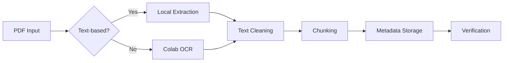

**Objective:** Convert raw PDFs into clean, structured text chunks with metadata
**Key Challenge:** Handle both text-based and scanned PDFs efficiently

```mermaid
flowchart LR
    A[PDF Input] --> B{Text-based?}
    B -->|Yes| C[Local Extraction]
    B -->|No| D[Colab OCR]
    C --> E[Text Cleaning]
    D --> E
    E --> F[Chunking]
    F --> G[Metadata Storage]
    G --> H[Verification]
```

# 1. PDF Ingestion & Type Detection
---

