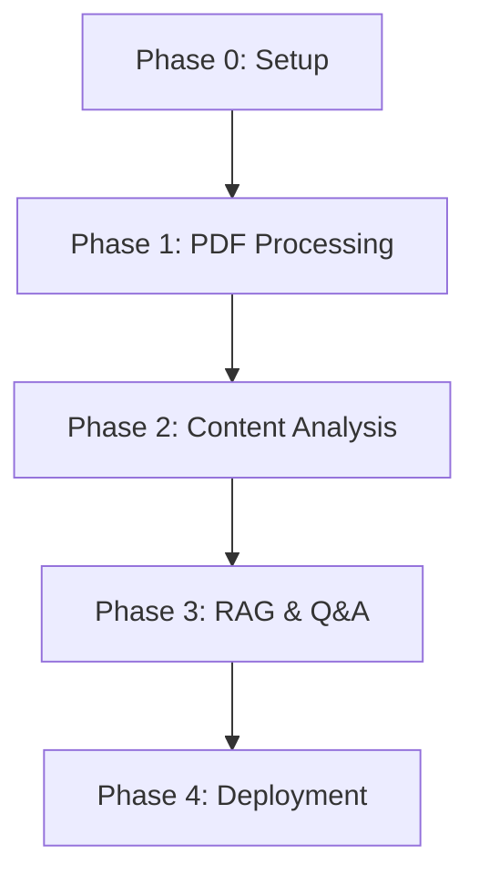
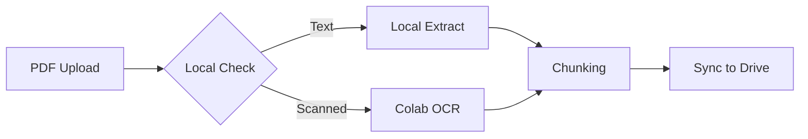
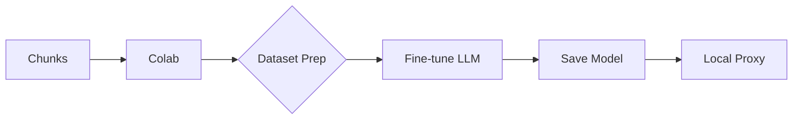
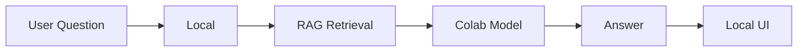
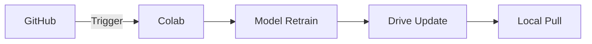

#active
[Core Tags::] #ai #pdf-processing #rag #lisa 
[Tech Stack::] #PyMuPDF #LangChain #Mistral-7B #ChromaDB #SQLite
[Workflow::] #colab #local #drive-sync
[Optimization::] #low-ram #quantization #batch-processing


Here's the **revised end-to-end project roadmap** incorporating Colab-based model training and local development, with strict directory structure and phase discipline:


# AI Book Mentor Project Roadmap  
---
**Core Principle**: *Colab for Heavy Lifting ↔ Local for UI/API*




## Phase 0: Foundation Setup (2 Days)
---
<br>

### **Objectives**
- Create bulletproof directory structure
- Establish Git/Colab workflow
- Configure environment constraints

### **Directory Structure**
```bash
.
├── .gitignore
├── config.yaml
├── requirements_local.txt
├── requirements_colab.txt
├── data/
│   ├── raw/              # Original PDFs (gitignored)
│   └── processed/        # Chunks from Phase1 (gitignored)
├── notebooks/            # Colab notebooks
│   ├── 1_pdf_processing.ipynb
│   └── 2_model_training.ipynb
├── src/
│   ├── local/            # Lightweight local code
│   │   ├── pdf_processing/
│   │   └── ui/
│   └── colab/            # Heavy processing modules
│       ├── model_trainer/
│       └── ocr_handler/
├── models/               # Trained models (gitignored)
│   ├── colab_models/
│   └── local_proxy/
└── docs/
    ├── ARCHITECTURE.md
    └── PHASE0.md
```

### **Key Deliverables**
- `.gitignore` with:

   ```gitignore
   # System
   venv/
   .ipynb_checkpoints/
   
   # Data
   data/raw/*
   data/processed/*
   
   # Models
   models/**
   !models/.gitkeep
   
   # Local secrets
   .env
   ```
   
- `config.yaml` with environment flags:
   ```yaml
   environments:
     local:
       data_path: "./data/processed"
       max_ram: 4GB
     colab:
       drive_mount: "/content/drive/MyDrive/book-mentor"
       enable_gpu: true
   ```


## Phase 1: PDF Processing (4 Days)
---

<br>

### **Workflow Split**


### **Local Tasks**
-  PDF type detection (text vs scanned)
-  Lightweight text extraction
- Metadata tracking (SQLite)

### **Colab Tasks**
- High-accuracy OCR processing
- Large PDF batch processing
- Drive storage integration

### **Outputs**
- `data/processed/chunks.json`
- SQLite DB with page↔chunk mapping


## Phase 2: Content Analysis & Model Training (6 Days)
---

<br>

### **Workflow**


### **Local Tasks**
-  Define model specs (Mistral-7B config)
- Create evaluation dataset
- Lightweight model testing

### **Colab Tasks**
- Dataset preparation from chunks
- LLM fine-tuning (QLoRA)
- Model quantization for local use
- Drive model storage

### **Outputs**
- Fine-tuned `mistral-7b-bookmentor` model
- Local CPU-compatible quantized model


## Phase 3: RAG & Q&A System (5 Days)
---

<br>

### **Workflow**


### **Local Tasks**
-  Chroma DB setup
- API/UI development (Gradio)
- Progress tracking

### **Colab Tasks**
- Embeddings generation
- Model serving API (FastAPI)
- Batch processing

### **Outputs**
- Local Q&A interface
- Colab model endpoint


## Phase 4: Deployment & CI/CD (3 Days)
---

<br>

### **Workflow**


### **Key Tasks**
1. Colab automation scripts
2. GitHub Actions for:
   - Data versioning
   - Model update alerts
3. Documentation site (MkDocs)


# Critical Path Dependencies
---

- **Phase 1 Must Complete** before model training
- **Colab Model Outputs** must match local input specs
- **Drive Sync** must use consistent paths

# Verification Checklist
---

| Phase | Local Check               | Colab Check           |
| ----- | ------------------------- | --------------------- |
| 1     | `python verify_chunks.py` | Notebook cell outputs |
| 2     | Model loading test        | Training loss curves  |
| 3     | Gradio UI test            | API response times    |
| 4     | CI/CD dry-run             | Automation logs       |

---

This roadmap maintains strict separation of concerns while enabling collaborative development. Each phase builds verifiable artifacts that feed into the next stage. Would you like me to elaborate on any particular phase's technical implementation strategy?