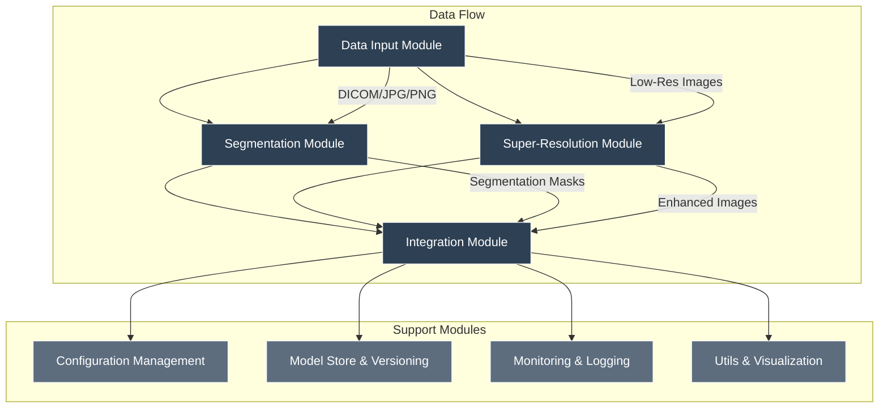

```
┌──────────────────────────────────────────────────────────────────┐ 
│                    SkinSegmentSrgan System                       │ 
├─────────────────┬─────────────────┬─────────────────┬────────────┤ 
│   Data Input    │   Segmentation  │ Super-Resolution│ Integration│ 
│     Module      │     Module      │     Module      │   Module   │ 
├─────────────────┼─────────────────┼─────────────────┼────────────┤ 
│ • Image Loading │ • U-Net Model   │ • SRGAN Model   │ • Pipeline │ 
│ • Validation    │ • Preprocessing │ • Enhancement   │ • Quality  │ 
│ • Preprocessing │ • Inference     │ • Postprocess   │ • Output   │ 
│ • Metadata      │ • Postprocess   │ • Validation    │ • Logging  │ 
└─────────────────┴───────────────────┴───────────────────┴────────┘ 
         │                   │                   │           │       
         ▼                   ▼                   ▼           ▼       
┌─────────────────┐ ┌─────────────────┐ ┌─────────────────┐ ┌───────┐
│  Configuration  │ │   Model Store   │ │   Monitoring    │ │ Utils │
│   Management    │ │   & Versioning  │ │   & Logging     │ │ & Viz │
└─────────────────┘ └─────────────────┘ └─────────────────┘ └───────┘ 
```

